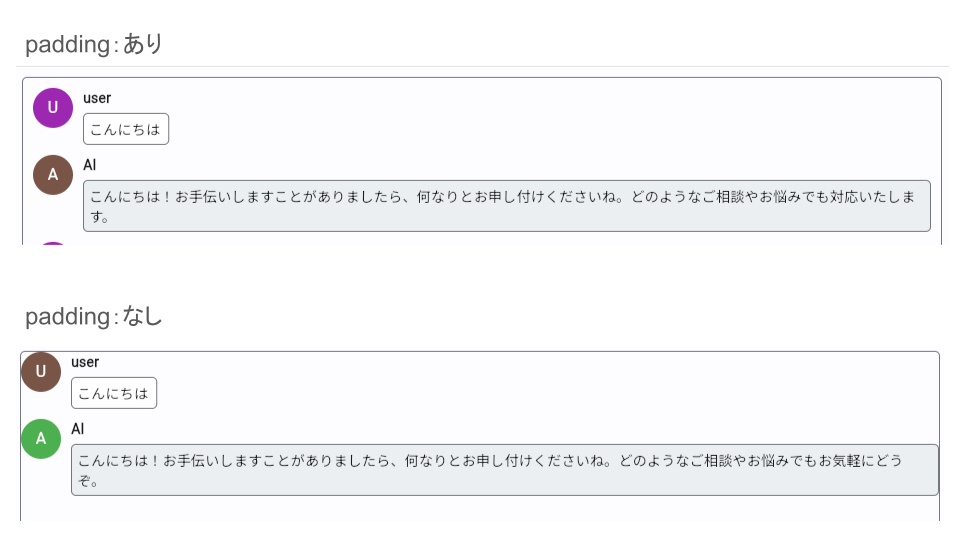

# Fletを使ったAIチャットアプリ

## Flatとは

Fletは、Pythonを使ってWebアプリ、デスクトップアプリ、モバイルアプリを簡単に開発できるフレームワークです。

[fletサイト](https://flet.dev/)

## 完成イメージ
GPUを使っています。
<!-- 動画  out.mp4-->
<div><video controls src="https://github.com/massao000/Flat-sample/assets/69783019/a763b1a6-9226-4314-ad76-a0676d611e2a" muted="false"></video></div>

## AIチャットの作成

Flatの[チャットアプリ](https://flet.dev/docs/tutorials/python-realtime-chat)のチュートリアルをベースにAIとチャットできるように改造していきます。

<!-- チャットアプリの[チュートリアルの解説](https://zenn.dev/shiro_toy_box/articles/0f2833f392b036) -->

- [ベースになるコード](../chat/main.py)
- [チャットアプリのドキュメント](../chat/README.md)


> 実行環境
> - flet Ver.0.21.2
> - Python Ver.3.10.11

### ライブラリのインストール

```
pip install flet
```

LLMを使うために`llama-cpp-python`パッケージをインストール\
[llama-cpp-python](https://github.com/abetlen/llama-cpp-python)

CPUを使う場合
```
pip install llama-cpp-python
```

GPUを使う場合
```
pip install llama-cpp-python --extra-index-url https://abetlen.github.io/llama-cpp-python/whl/<cudaのバージョン> --upgrade --force-reinstall --no-cache-dir
```
`<cudaのバージョン>`は以下のいずれかになります。
- cu121: CUDA12.1
- cu122: CUDA12.2
- cu123: CUDA12.3
- cu124: CUDA12.4

`nvidia-smi`を使い自身の使っているcudaのバージョンを確認してください。\
例えば`CUDA12.1`の場合のインストール方法は以下のようになります。
```
pip install llama-cpp-python --extra-index-url https://abetlen.github.io/llama-cpp-python/whl/cu121 --upgrade --force-reinstall --no-cache-dir
```

参考\
[llama-cpp-pythonでGPUを使う方法](https://zenn.dev/saldra/articles/8785e45e1db493)

> llama-cpp-pythonについて\
> llama-cpp-pythonは、Llama.cppをPythonで扱えるようにしたバインディングです。
> 
> そのLlama.cppとは何か
> 1. 様々なハードウェアで LLM 推論を最小限の設定で可能にする
> 1. 幅広いハードウェアで LLM 推論を最先端のパフォーマンスで実現する


使用するLLM
- 元のLLM
    - https://huggingface.co/DataPilot/ArrowPro-7B-KUJIRA
- GGUFモデル
    - https://huggingface.co/mmnga/DataPilot-ArrowPro-7B-KUJIRA-gguf/blob/main/DataPilot-ArrowPro-7B-KUJIRA-Q6_K.gguf

`llama-cpp-python`を使うには`GGUF`化したモデルを使う必要があります。

### チャットアプリの不要なコードを削除

ベースコードの`main関数`から不要なコードを削除していきます。\
`Message`クラスと`ChatMessage`クラスは削除するコードはありますん。

`on_message`関数のif-elif文とlogin時のテキストの削除、チャットする際の名前設定ダイアログ関連の削除、メッセージをリアルタイムに別のタブと同期する`pubsub`の削除

<!-- ベースコードから不要なコード削除コード -->
```diff py 
def main(page: ft.Page):
    page.title = 'チャット'
    
    def on_message(message: Message):
-        if message.message_type == "chat_message":
            m = ChatMessage(message)
-        elif message.message_type =="login_message":
-            m = ft.Text(message.text, italic=True, color=ft.colors.BLACK45, size=12)
        chat.controls.append(m)
        page.update()
        
-     page.pubsub.subscribe(on_message)
    
    def send_message_click(e):
        if new_message.value != "":
-            page.pubsub.send_all(Message(user_name=page.session.get('user_name'), text=new_message.value, message_type="chat_message"))
            new_message.value = ''
            new_message.focus()
            page.update()

##### 名前設定ダイアログ関連 #####
-    join_user_name  = ft.TextField(label="Enter your name")
-    
-    def join_click(e):
-        if not join_user_name.value:
-            join_user_name.error_text = "Name cannot be blank!"
-            join_user_name.update()
-        else:
-            page.session.set("user_name", join_user_name.value)
-            page.dialog.open = False
-            page.pubsub.send_all(Message(user_name=join_user_name.value, text=f"{join_user_name.value} has joined the chat.", message_type="login_message"))
-            page.update()
-        
-    page.dialog = ft.AlertDialog(
-        open = True,
-        modal = True,
-        title = ft.Text("Welcome!"),
-        content = ft.Column([join_user_name], tight=True),
-        actions = [ft.ElevatedButton(text="Join chat", on_click=join_click)],
-        actions_alignment = "end"
-    )
##########

    chat = ft.ListView(
        expand = True,
        spacing = 10,
        auto_scroll = True
    )
    
    new_message = ft.TextField(
        hint_text = "Write a message...",
        autocorrect = True,
        shift_enter = True,
        min_lines = 1,
        max_lines = 5,
        filled = True,
        expand = True,
        on_submit = send_message_click
    )
    
    page.add(
        ft.Container(
            content = chat,
            border = ft.border.all(1, ft.colors.OUTLINE),
            border_radius = 5,
            expand = True,
        ),
        ft.Row(
            [
                new_message, 
                ft.IconButton(
                    icon = ft.icons.SEND_ROUNDED,
                    tooltip = "Send message",
                    on_click = send_message_click
                )
            ]
        )
    )


ft.app(target=main, view=ft.AppView.WEB_BROWSER)
```

<details>
<summary>削除あとの全体コード</summary>

<!-- 消去後の全体のコード -->
```py
import flet as ft

class Message():
    def __init__(self, user_name: str, text: str, message_type: str):
        self.user_name = user_name
        self.text = text
        self.message_type = message_type

class ChatMessage(ft.Row):
    def __init__(self, message:Message):
        super().__init__()
        self.vertical_alignment = "start"
        self.controls = [
            ft.CircleAvatar(
                content=ft.Text(self.get_initials(message.user_name)),
                color=ft.colors.WHITE,
                bgcolor=self.get_avatar_color(message.user_name)
            ),
            ft.Column(
                [
                    ft.Text(message.user_name, weight="bold"),
                    ft.Text(message.text, selectable=True)
                ],
                tight=True,
                spacing=5,
            )
        ]
    
    def get_initials(self, user_name: str):
        return user_name[:1].capitalize()
    
    def get_avatar_color(self, user_name: str):
        colors_lookup = [
            ft.colors.AMBER,
            ft.colors.BLUE,
            ft.colors.BROWN,
            ft.colors.CYAN,
            ft.colors.GREEN,
            ft.colors.INDIGO,
            ft.colors.LIME,
            ft.colors.ORANGE,
            ft.colors.PINK,
            ft.colors.PURPLE,
            ft.colors.RED,
            ft.colors.TEAL,
            ft.colors.YELLOW,
        ]
    
        return colors_lookup[hash(user_name) % len(colors_lookup)]

def main(page: ft.Page):
    page.title = 'チャット'
    
    def on_message(message: Message):
        m = ChatMessage(message)
        chat.controls.append(m)
        page.update()
        
    
    def send_message_click(e):
        if new_message.value != "":
            new_message.value = ''
            new_message.focus()
            page.update()
    
    chat = ft.ListView(
        expand = True,
        spacing = 10,
        auto_scroll = True
    )
    
    new_message = ft.TextField(
        hint_text = "Write a message...",
        autocorrect = True,
        shift_enter = True,
        min_lines = 1,
        max_lines = 5,
        filled = True,
        expand = True,
        on_submit = send_message_click
    )
    
    page.add(
        ft.Container(
            content = chat,
            border = ft.border.all(1, ft.colors.OUTLINE),
            border_radius = 5,
            expand = True,
        ),
        ft.Row(
            [
                new_message, 
                ft.IconButton(
                    icon = ft.icons.SEND_ROUNDED,
                    tooltip = "Send message",
                    on_click = send_message_click
                )
            ]
        )
    )


ft.app(target=main, view=ft.AppView.WEB_BROWSER)
```

</details>

### コードの追加と書き換え

`llama-cpp-python`ライブラリのインポート
```py
import flet as ft
from llama_cpp import Llama # llama-cpp-python
```

<!-- 新しく追加するコード -->
```diff　py
+llm = Llama(
+    model_path="LLMのファイルパス",
+    # n_gpu_layers=-1, # コメントをはずしてGPUを使う
+    n_ctx=2048
+)
+def ai_chat(message):
+    chat_history = [
+        {"role": "system", "content": "あなたは日本語を話す優秀なアシスタントです。回答には必ず日本語で答えてください。"},
+        {
+            "role": "user",
+            "content": message}
+    ]

+    output = llm.create_chat_completion(messages=chat_history)

+    return output["choices"][0]["message"]["content"]

def main(page: ft.Page):
-    page.title = 'チャット'
+    page.title = 'AIチャット'
    
    def on_message(message: Message):
        m = ChatMessage(message)
        chat.controls.append(m)
        page.update()

+    def message_creation(name, text, message_type):
+        on_message(Message(user_name=name, text=text, message_type=message_type))
    
    def send_message_click(e):
        if new_message.value != "":
+            message_creation('user', new_message.value, 'human')
+            send_message = new_message.value
            new_message.value = ''
-            new_message.focus()
            page.update()

+            ai_mes = ai_chat(send_message)
+            message_creation('AI', ai_mes, 'ai')

+            new_message.focus()
+            page.update()

    chat = ft.ListView(
        expand = True,
        spacing = 10,
        auto_scroll = True
    )
    
    new_message = ft.TextField(
        hint_text = "Write a message...",
        autocorrect = True,
        shift_enter = True,
        min_lines = 1,
        max_lines = 5,
        filled = True,
        expand = True,
        on_submit = send_message_click
    )
    
    page.add(
        ft.Container(
            content = chat,
            border = ft.border.all(1, ft.colors.OUTLINE),
            border_radius = 5,
            expand = True,
        ),
        ft.Row(
            [
                new_message, 
                ft.IconButton(
                    icon = ft.icons.SEND_ROUNDED,
                    tooltip = "Send message",
                    on_click = send_message_click
                )
            ]
        )
    )


ft.app(target=main, view=ft.AppView.WEB_BROWSER)
```

#### 新しく追加したコードについて

LLMのチャットをする関数の追加
```py
llm = Llama(
    model_path="LLMのファイルパス",
    # n_gpu_layers=-1, # コメントをはずしてGPUを使う
    n_ctx=2048
)
def ai_chat(message):
    chat_history = [
        {"role": "system", "content": "あなたは日本語を話す優秀なアシスタントです。回答には必ず日本語で答えてください。"},
        {
            "role": "user",
            "content": message}
    ]

    output = llm.create_chat_completion(messages=chat_history)
    return output["choices"][0]["message"]["content"]
```

`main`関数の中に新しく`message_creation`関数を追加。\
`Message`オブジェクトを`on_message`関数に渡します。
```py
    def message_creation(name, text, message_type):
        on_message(Message(user_name=name, text=text, message_type=message_type))
```

送信がされた際に発生するイベント関数
```py
    def send_message_click(e):
        if new_message.value != "":
            message_creation('user', new_message.value, 'human')
            send_message = new_message.value # Aiに送信するメッセージをsend_messageにコピー
            new_message.value = '' # 入力のメッセージを空白にする
            page.update()

            ai_mes = ai_chat(send_message)
            message_creation('AI', ai_mes, 'ai')

            new_message.focus()
            page.update()
```

<details>
<summary>全体コード</summary>

<!-- 全体のコード -->
```py
import flet as ft
from llama_cpp import Llama

class Message():
    def __init__(self, user_name: str, text: str, message_type: str):
        self.user_name = user_name
        self.text = text
        self.message_type = message_type

class ChatMessage(ft.Row):
    def __init__(self, message:Message):
        super().__init__()
        self.vertical_alignment = "start"
        self.controls = [
            ft.CircleAvatar(
                content=ft.Text(self.get_initials(message.user_name)),
                color=ft.colors.WHITE,
                bgcolor=self.get_avatar_color(message.user_name)
            ),
            ft.Column(
                [
                    ft.Text(message.user_name, weight="bold"),
                    ft.Text(message.text, selectable=True)
                ],
                tight=True,
                spacing=5,
            )
        ]
    
    def get_initials(self, user_name: str):
        return user_name[:1].capitalize()
    
    def get_avatar_color(self, user_name: str):
        colors_lookup = [
            ft.colors.AMBER,
            ft.colors.BLUE,
            ft.colors.BROWN,
            ft.colors.CYAN,
            ft.colors.GREEN,
            ft.colors.INDIGO,
            ft.colors.LIME,
            ft.colors.ORANGE,
            ft.colors.PINK,
            ft.colors.PURPLE,
            ft.colors.RED,
            ft.colors.TEAL,
            ft.colors.YELLOW,
        ]
    
        return colors_lookup[hash(user_name) % len(colors_lookup)]

##### LLMの処理 #####
llm = Llama(
    model_path="LLMのファイルパス",
    # n_gpu_layers=-1, # コメントをはずしてGPUを使う
    n_ctx=2048
)
def ai_chat(message):
    chat_history = [
        {"role": "system", "content": "あなたは日本語を話す優秀なアシスタントです。回答には必ず日本語で答えてください。"},
        {
            "role": "user",
            "content": message}
    ]

    output = llm.create_chat_completion(messages=chat_history)

    return output["choices"][0]["message"]["content"]
#####

def main(page: ft.Page):
    page.title = 'AIチャット'
    
    def on_message(message: Message):
        m = ChatMessage(message)
        chat.controls.append(m)
        page.update()
    
    def message_creation(name, text, message_type):
        on_message(Message(user_name=name, text=text, message_type=message_type))
    
    def send_message_click(e):
        if new_message.value != "":
            message_creation('user', new_message.value, 'human')
            send_message = new_message.value
            new_message.value = ''
            page.update()
            
            ai_mes = ai_chat(send_message)
            message_creation('AI', ai_mes, 'ai')
            
            new_message.focus()
            page.update()
        
    
    chat = ft.ListView(
        expand = True,
        spacing = 10,
        auto_scroll = True
    )
    
    new_message = ft.TextField(
        hint_text = "Write a message...",
        autocorrect = True,
        shift_enter = True,
        min_lines = 1,
        max_lines = 5,
        filled = True,
        expand = True,
        on_submit = send_message_click
    )
    
    page.add(
        ft.Container(
            content = chat,
            border = ft.border.all(1, ft.colors.OUTLINE),
            border_radius = 5,
            expand = True,
        ),
        ft.Row(
            [
                new_message, 
                ft.IconButton(
                    icon = ft.icons.SEND_ROUNDED,
                    tooltip = "Send message",
                    on_click = send_message_click
                )
            ]
        )
    )


ft.app(target=main, view=ft.AppView.WEB_BROWSER)
```

</details>

これでAIとチャットするアプリの完成です。

最後にデザインのアップデートを行っていきます。

### デザインのアップデート

- `ChatMessage`クラスの編集、チャットの囲いとユーザとAIのチャットを区別しやすく背景色を付けます。
- `main`関数の編集、AIチャットの返答待ちがわかりやすくするためにプログレスバーを追加する、詰めたUIに隙間を作る

#### ChatMessage

表示するチャットに`ft.Container`を使い囲いと背景色を追加しています。
```diff　py
class ChatMessage(ft.Row):
    def __init__(self, message:Message):
        super().__init__()
        self.vertical_alignment = "start"
        self.controls = [
            ft.CircleAvatar(
                content=ft.Text(self.get_initials(message.user_name)),
                color=ft.colors.WHITE,
                bgcolor=self.get_avatar_color(message.user_name)
            ),
            ft.Column(
                [
                    ft.Text(message.user_name, weight="bold"),
-                    ft.Text(message.text, selectable=True)
+                    ft.Container(
+                        content = ft.Text(message.text, selectable=True),
+                        bgcolor = self.get_bgcolor(message.message_type), #背景色
+                        border = ft.border.all(1, ft.colors.OUTLINE), # 囲い
+                        border_radius = 5, # 囲いの丸み
+                        padding = 5
+                        )
                ],
                tight=True,
                spacing=5,
+                expand=True #文字のスペースを埋める（テキストをはみ出ないようにした）
            ),
        ]
```

人間とAIでチャットの背景色を分ける関数
[カラー表](https://flet-controls-gallery.fly.dev/colors/colorpalettes)
```py
    # チャットの装飾
    def get_bgcolor(self, chat_type):
        if chat_type == 'ai':
            color = ft.colors.BLUE_GREY_50
        else:
            color = ft.colors.WHITE
            
        return color
```

#### main

AIのチャットの待ち状態を視覚的にわかりやすくるするために`ft.ProgressBar`を使いプログレスパーの追加。
AIのチャットの返答待ちの時だけ表示したいのでプログレスバーを非表示にしています。

- ft.ProgressBarの引数の説明
    - color：進むバーの色
    - bgcolor：バーの背景色
    - visible：表示(True)/非表示(False)

`padding`を使い空きスペースを作る

ありとなしの実際の画像
<!-- どのように変わるか比較の画像を入れる -->


```diff　py
    def send_message_click(e):
        if new_message.value != "":
            message_creation('user', new_message.value, 'human')
            send_message = new_message.value
            new_message.value = ''
+            progress.visible = True # プログレスバーの表示
            page.update()
            
            ai_mes = ai_chat(send_message)
            message_creation('AI', ai_mes, 'ai')
            
+            progress.visible = False # プログレスバーの非表示
            new_message.focus()
            page.update()

    # プログレスバー
+    progress = ft.ProgressBar(
+        color = ft.colors.PINK,
+        bgcolor = ft.colors.GREY_200,
+        visible = False #非表示にする
+    )

    page.add(
        ft.Container(
            content = chat,
            border = ft.border.all(1, ft.colors.OUTLINE),
            border_radius = 5,
+            padding = 10,
            expand = True,
        ),
+        progress,
        ft.Row(
            [
                new_message, 
                ft.IconButton(
                    icon = ft.icons.SEND_ROUNDED,
                    tooltip = "Send message",
                    on_click = send_message_click
                )
            ]
        )
    )
```

<details>
<summary>完成コード</summary>

<!-- 完成のコード -->
```py
import flet as ft
from llama_cpp import Llama

class Message():
    def __init__(self, user_name: str, text: str, message_type: str):
        self.user_name = user_name
        self.text = text
        self.message_type = message_type

class ChatMessage(ft.Row):
    def __init__(self, message:Message):
        super().__init__()
        self.vertical_alignment = "start"
        self.controls = [
            ft.CircleAvatar(
                content=ft.Text(self.get_initials(message.user_name)),
                color=ft.colors.WHITE,
                bgcolor=self.get_avatar_color(message.user_name)
            ),
            ft.Column(
                [
                    ft.Text(message.user_name, weight="bold"),
                    # ft.Text(message.text, selectable=True)
                    ft.Container(
                        content = ft.Text(message.text, selectable=True),
                        bgcolor = self.get_bgcolor(message.message_type), #背景色
                        border = ft.border.all(1, ft.colors.OUTLINE), # 囲い
                        border_radius = 5, # 囲いの丸み
                        padding = 5
                        )
                ],
                tight=True,
                spacing=5,
                expand=True #文字のスペースを埋める（テキストをはみ出ないようにした）
            ),
        ]
        
    # チャットの装飾
    def get_bgcolor(self, chat_type):
        if chat_type == 'ai':
            color = ft.colors.BLUE_GREY_50
        else:
            color = ft.colors.WHITE
            
        return color
        
    
    def get_initials(self, user_name: str):
        return user_name[:1].capitalize()
    
    def get_avatar_color(self, user_name: str):
        colors_lookup = [
            ft.colors.AMBER,
            ft.colors.BLUE,
            ft.colors.BROWN,
            ft.colors.CYAN,
            ft.colors.GREEN,
            ft.colors.INDIGO,
            ft.colors.LIME,
            ft.colors.ORANGE,
            ft.colors.PINK,
            ft.colors.PURPLE,
            ft.colors.RED,
            ft.colors.TEAL,
            ft.colors.YELLOW,
        ]
    
        return colors_lookup[hash(user_name) % len(colors_lookup)]

llm = Llama(
    model_path="LLMのファイルパス",
    # n_gpu_layers=-1, # コメントをはずしてGPUを使う
    n_ctx=2048
)
def ai_chat(message):
    chat_history = [
        {"role": "system", "content": "あなたは日本語を話す優秀なアシスタントです。回答には必ず日本語で答えてください。"},
        {
            "role": "user",
            "content": message}
    ]

    output = llm.create_chat_completion(messages=chat_history)

    return output["choices"][0]["message"]["content"]


def main(page: ft.Page):
    page.title = 'AIチャット'
    
    def on_message(message: Message):
        m = ChatMessage(message)
        chat.controls.append(m)
        page.update()
    
    def message_creation(name, text, message_type):
        on_message(Message(user_name=name, text=text, message_type=message_type))
    
    def send_message_click(e):
        if new_message.value != "":
            message_creation('user', new_message.value, 'human')
            send_message = new_message.value
            new_message.value = ''
            progress.visible = True # プログレスバーの表示
            page.update()
            
            ai_mes = ai_chat(send_message)
            message_creation('AI', ai_mes, 'ai')
            
            progress.visible = False # プログレスバーの非表示
            new_message.focus()
            page.update()
            
    # プログレスバー
    progress = ft.ProgressBar(
        color = ft.colors.PINK, # 進むバーの色
        bgcolor = ft.colors.GREY_200, # バーの背景色
        visible = False # 非表示にする
    )
    
    chat = ft.ListView(
        expand = True,
        spacing = 10,
        auto_scroll = True
    )
    
    new_message = ft.TextField(
        hint_text = "Write a message...",
        autocorrect = True,
        shift_enter = True,
        min_lines = 1,
        max_lines = 5,
        filled = True,
        expand = True,
        on_submit = send_message_click
    )
    
    page.add(
        ft.Container(
            content = chat,
            border = ft.border.all(1, ft.colors.OUTLINE),
            border_radius = 5,
            padding = 10,
            expand = True,
        ),
        progress,
        ft.Row(
            [
                new_message, 
                ft.IconButton(
                    icon = ft.icons.SEND_ROUNDED,
                    tooltip = "Send message",
                    on_click = send_message_click
                )
            ]
        )
    )


ft.app(target=main, view=ft.AppView.WEB_BROWSER)
```

</details>