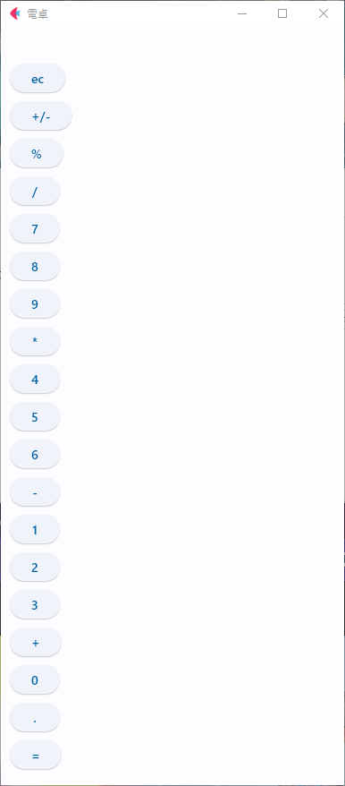
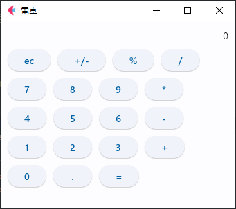
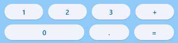
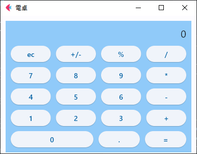

# Flatを少しでも理解するためにチュートリアルをやる

## Flatとは

Fletは、Pythonを使ってWebアプリ、デスクトップアプリ、モバイルアプリを簡単に開発できるフレームワークです。

https://flet.dev/

## 電卓の作成

- [公式チュートリアル](https://flet.dev/docs/tutorials/python-calculator)
- [公式サンプルコード](https://github.com/flet-dev/examples/blob/main/python/tutorials/calc/calc.py)

チュートリアルを参考に電卓アプリをつくって行きます。

チュートリアルではクラスを使っていますがここでは関数のみでやっています。


> 実行環境
> - flet Ver.0.21.2
> - Python Ver.3.10.11


### ライブラリのインストール

`pip`を使い`flet`をインストールします。

```
pip install flet
```

### ボタンの作成

電卓に必要なボタンを用意します。

結果を表示するための`ft.Text`と、イベントを起こすためのボタン`ft.ElevatedButton`を使います。

```py
def main(page: ft.Page):
    page.title = '電卓'

    result = ft.Ref[ft.Text]()
    
    page.add(
        ft.Text(ref=result),
        ft.ElevatedButton('ec'), 
        ft.ElevatedButton('+/-'), 
        ft.ElevatedButton('%'), 
        ft.ElevatedButton('/'),
        ft.ElevatedButton('7'), 
        ft.ElevatedButton('8'), 
        ft.ElevatedButton('9'), 
        ft.ElevatedButton('*'),
        ft.ElevatedButton('4'), 
        ft.ElevatedButton('5'), 
        ft.ElevatedButton('6'), 
        ft.ElevatedButton('-'),
        ft.ElevatedButton('1'), 
        ft.ElevatedButton('2'), 
        ft.ElevatedButton('3'), 
        ft.ElevatedButton('+'),
        ft.ElevatedButton('0'), 
        ft.ElevatedButton('.'), 
        ft.ElevatedButton('=')
        )


ft.app(target=main)
```



### レイアウトの調整

[`ft.Row`](https://flet.dev/docs/controls/row)を使い電卓のレイアウトにします。

```py
def main(page: ft.Page):
    page.title = '電卓'

    # ウィンドウサイズ
    page.window_width = 400
    page.window_height = 310

    result = ft.Ref[ft.Text]()
    
    page.add(
        ft.Row([ft.Text(ref=result, value=0)], alignment="end"),
        ft.Row([ft.ElevatedButton('ec'), ft.ElevatedButton('+/-'), ft.ElevatedButton('%'), ft.ElevatedButton('/')]),
        ft.Row([ft.ElevatedButton('7'), ft.ElevatedButton('8'), ft.ElevatedButton('9'), ft.ElevatedButton('*')]),
        ft.Row([ft.ElevatedButton('4'), ft.ElevatedButton('5'), ft.ElevatedButton('6'), ft.ElevatedButton('-')]),
        ft.Row([ft.ElevatedButton('1'), ft.ElevatedButton('2'), ft.ElevatedButton('3'), ft.ElevatedButton('+')]),
        ft.Row([ft.ElevatedButton('0'), ft.ElevatedButton('.'), ft.ElevatedButton('=')])
    )


ft.app(target=main)
```



### レイアウトのカスタム

`ft.ElevatedButton`に押されたときにボタンを区別するために`data`を設定。

行数を調整する`expand`を加えます。

`expand`を`2`にすることで0ボタンを二行使うことができます。


- [`ft.Container`](https://flet.dev/docs/controls/container/)を使用すると、背景色と境界線の装飾や、ほかのコンポーネントをグループ化し、レイアウトを制御できます
- [`ft.Column`](https://flet.dev/docs/controls/column)は垂直配列で表示することができる
- [`ft.colors`](https://flet-controls-gallery.fly.dev/colors/colorpalettes)背景色の設定

```py
def main(page: ft.Page):
    page.title = '電卓'

    # ウィンドウサイズ
    page.window_width = 400
    page.window_height = 310

    result = ft.Ref[ft.Text]()
    
    page.add(
        ft.Container(
            padding=10,
            bgcolor=ft.colors.BLUE_200, #背景色の変更
            content=ft.Column([
                ft.Row([ft.Text(ref=result, value=0, size=20)], alignment="end"),
                ft.Row([ft.ElevatedButton('ec', data='ce', expand=1), ft.ElevatedButton('+/-', data='+/-', expand=1), ft.ElevatedButton('%', data='%', expand=1), ft.ElevatedButton('/', data='/',expand=1)]),
                ft.Row([ft.ElevatedButton('7', data='7', expand=1), ft.ElevatedButton('8', data='8', expand=1), ft.ElevatedButton('9', data='9', expand=1), ft.ElevatedButton('*', data='*', expand=1)]),
                ft.Row([ft.ElevatedButton('4', data='4', expand=1), ft.ElevatedButton('5', data='5', expand=1), ft.ElevatedButton('6', data='6', expand=1), ft.ElevatedButton('-', data='-', expand=1)]),
                ft.Row([ft.ElevatedButton('1', data='1', expand=1), ft.ElevatedButton('2', data='2', expand=1), ft.ElevatedButton('3', data='3', expand=1), ft.ElevatedButton('+', data='+', expand=1)]),
                ft.Row([ft.ElevatedButton('0', data='0', expand=2), ft.ElevatedButton('.', data='.', expand=1), ft.ElevatedButton('=', data='=', expand=1)]),
            ])
        )
    )


ft.app(target=main)
```

### ボタンのイベント処理

#### ボタンにクリックイベントの設定
イベントを起こすために全てのボタンに`on_click=self.button_clicked`を追加します。

```py
ft.ElevatedButton('ec', data='ce', expand=1, on_click=button_click)
```



#### イベント処理

`calculate` `format_number` `button_click`関数を作成します。

- calculate
    - 計算をする関数
- format_number
    - 数値の書式を整える
- button_click
    - ボタンが押されたときのイベント処理

電卓の初期値を設定
```py
new_operand = True # 計算結果を上書きするかどうかのフラグ
operand1 = 0 # 計算途中の値を一時的に記憶する変数
operator = '+' # 演算子
```

```py
def calculate(num1, num2, operator):
    """
    2つの数値と演算子を渡すと、計算結果を返します。

    Args:
        num1: 1つ目の数値
        num2: 2つ目の数値
        operator: 演算子 ( +, -, *, / )

    Returns:
        計算結果
    """
    if operator == '+':
        return format_number(num1 + num2)
    elif operator == '-':
        return format_number(num1 - num2)
    elif operator == '*':
        return format_number(num1 * num2)
    elif operator == '/':
        if num2 == 0:
            return 'Error'
        else:
            return format_number(num1 / num2)
```  

```py
def format_number(num):
    """
    少数かどうかで、数値の書式を整えて返します。

    Args:
        num: 整数または浮動小数点数

    Returns:
        整数の場合は int 型、少数の場合 float 型の値
    """
    return int(num) if num % 1 == 0 else num
```

```py
def button_click(e):
    """
    ボタンイベント

    Args:
        e: ElevatedButtonの情報

    Returns:
    """

    global new_operand, operand1, operator
    
    data = e.control.data
    print(data)
    
    if data == 'ce' or result.current.value == 'Error':
        result.current.value = '0'
        new_operand = True
        operand1 = 0
        operator = '+'
    elif data in ('0', '1', '2', '3', '4', '5', '6', '7', '8', '9', '.'):
        if result.current.value == '0' or new_operand == True:
            result.current.value = data
            new_operand = False
        else:
            result.current.value += data
    elif data in ("+", "-", "*", "/"):
        result.current.value = calculate(operand1, float(result.current.value), operator)
        operator = data
        
        if result.current.value == 'Error':
            operand1 = 0
        else:
            operand1 = float(result.current.value)
        new_operand = True
    elif data in ('='):
        result.current.value = calculate(operand1, float(result.current.value), operator)
        new_operand = True
        operand1 = 0
        operator = '+'
    elif data in ('%'):
        result.current.value = float(result.current.value) / 100
        new_operand = True
        operand1 = 0
        operator = '+'
    elif data in ('+/-'):
        tmp = float(result.current.value)
        
        if tmp > 0:
            result.current.value = f"-{tmp}"
        else:
            result.current.value = str(format_number(abs(tmp)))
        
    page.update()
```


全体のコード
```py
import flet as ft

new_operand = True # 計算結果を上書きするかどうかのフラグ
operand1 = 0 # 計算途中の値を一時的に記憶する変数
operator = '+' # 演算子

def calculate(num1, num2, operator):
    """
    2つの数値と演算子を渡すと、計算結果を返します。

    Args:
        num1: 1つ目の数値
        num2: 2つ目の数値
        operator: 演算子 ( +, -, *, / )

    Returns:
        計算結果
    """
    if operator == '+':
        return format_number(num1 + num2)
    elif operator == '-':
        return format_number(num1 - num2)
    elif operator == '*':
        return format_number(num1 * num2)
    elif operator == '/':
        if num2 == 0:
            return 'Error'
        else:
            return format_number(num1 / num2)
        
def format_number(num):
    """
    少数かどうかで、数値の書式を整えて返します。

    Args:
        num: 整数または浮動小数点数

    Returns:
        整数の場合は int 型、少数の場合 float 型の値
    """
    return int(num) if num % 1 == 0 else num


def main(page: ft.Page):
    page.title = '電卓'

    # ウィンドウサイズ
    page.window_width = 400
    page.window_height = 310
    
    result = ft.Ref[ft.Text]()
    
    def button_click(e):
        """
        ボタンイベント

        Args:
            e: ElevatedButtonの情報

        Returns:
        """

        global new_operand, operand1, operator
        
        data = e.control.data
        print(data)
        
        if data == 'ce' or result.current.value == 'Error':
            result.current.value = '0'
            new_operand = True
            operand1 = 0
            operator = '+'
        elif data in ('0', '1', '2', '3', '4', '5', '6', '7', '8', '9', '.'):
            if result.current.value == '0' or new_operand == True:
                result.current.value = data
                new_operand = False
            else:
                result.current.value += data
        elif data in ("+", "-", "*", "/"):
            result.current.value = calculate(operand1, float(result.current.value), operator)
            operator = data
            
            if result.current.value == 'Error':
                operand1 = 0
            else:
                operand1 = float(result.current.value)
            new_operand = True
        elif data in ('='):
            result.current.value = calculate(operand1, float(result.current.value), operator)
            new_operand = True
            operand1 = 0
            operator = '+'
        elif data in ('%'):
            result.current.value = float(result.current.value) / 100
            new_operand = True
            operand1 = 0
            operator = '+'
        elif data in ('+/-'):
            tmp = float(result.current.value)
            
            if tmp > 0:
                result.current.value = f"-{tmp}"
            else:
                result.current.value = str(format_number(abs(tmp)))
            
        page.update()

    
    page.add(
        ft.Container(
            padding=10,
            content=ft.Column([
                ft.Row([ft.Text(ref=result, value=0, size=20)], alignment="end"),
                ft.Row([ft.ElevatedButton('ec', data='ce', expand=1, on_click=button_click), ft.ElevatedButton('+/-', data='+/-', expand=1, on_click=button_click), ft.ElevatedButton('%', data='%', expand=1, on_click=button_click), ft.ElevatedButton('/', data='/',expand=1, on_click=button_click)]),
                ft.Row([ft.ElevatedButton('7', data='7', expand=1, on_click=button_click), ft.ElevatedButton('8', data='8', expand=1, on_click=button_click), ft.ElevatedButton('9', data='9', expand=1, on_click=button_click), ft.ElevatedButton('*', data='*', expand=1, on_click=button_click)]),
                ft.Row([ft.ElevatedButton('4', data='4', expand=1, on_click=button_click), ft.ElevatedButton('5', data='5', expand=1, on_click=button_click), ft.ElevatedButton('6', data='6', expand=1, on_click=button_click), ft.ElevatedButton('-', data='-', expand=1, on_click=button_click)]),
                ft.Row([ft.ElevatedButton('1', data='1', expand=1, on_click=button_click), ft.ElevatedButton('2', data='2', expand=1, on_click=button_click), ft.ElevatedButton('3', data='3', expand=1, on_click=button_click), ft.ElevatedButton('+', data='+', expand=1, on_click=button_click)]),
                ft.Row([ft.ElevatedButton('0', data='0', expand=2, on_click=button_click), ft.ElevatedButton('.', data='.', expand=1, on_click=button_click), ft.ElevatedButton('=', data='=', expand=1, on_click=button_click)]),
            ])
        )
    )


ft.app(target=main)
```

### 結果

<!-- 動画 -->
<div><video controls src="https://github.com/massao000/Flat-sample/assets/69783019/45f94e62-945e-4b38-ac3a-9fa800b83413" muted="false"></video></div>

<!-- <div><video controls src="../calculator/sozai/calculator.mp4" muted="false"></video></div> -->

## 参考

https://flet-controls-gallery.fly.dev/layout

https://flet.dev/docs/