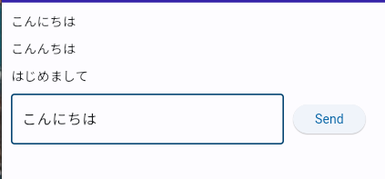
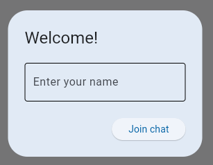
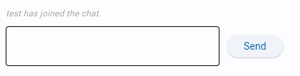
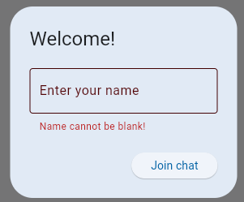

# Flatを少しでも理解するためにチュートリアルをやる - チャット

## Flatとは

Fletは、Pythonを使ってWebアプリ、デスクトップアプリ、モバイルアプリを簡単に開発できるフレームワークです。

https://flet.dev/

## 完成イメージ
<!-- 動画  end_.mp4-->
<div><video controls src="https://github.com/massao000/Flat-sample/assets/69783019/00f015e6-2809-46bb-b499-7c5dccd299fa" muted="false"></video></div>

## チャットの作成

- [公式チュートリアル](https://flet.dev/docs/tutorials/python-realtime-chat)
- [公式サンプルコード](https://github.com/flet-dev/examples/blob/main/python/tutorials/chat/chat.py)

チュートリアルを参考にチャットアプリをつくって行きます。

> 実行環境
> - flet Ver.0.21.2
> - Python Ver.3.10.11


### ライブラリのインストール

`pip`を使い`flet`をインストールします。

```
pip install flet
```

<br>

### メッセージの表示

ユーザのメッセージ送信とメッセージ履歴表示の基礎を作ります。

このプログラムには以下のコントロールを使っています
- [`Text`](https://flet.dev/docs/controls/text/) チャットを表示するテキスト
- [`TextField`](https://flet.dev/docs/controls/textfield/) チャットメッセージの記入
- [`ElevatedButton`](https://flet.dev/docs/controls/elevatedbutton/) メッセージの送信ボタン
- [`Column`](https://flet.dev/docs/controls/column/) メッセージ（テキスト）を垂直に表示をする
- [`Row`](https://flet.dev/docs/controls/row/) TextFieldとElevatedButtonを水平に表示する

全体のコード
```py:01.py
import flet as ft

def main(page: ft.Page):
    # チャットメッセージを表示するコントロール
    chat = ft.Column()

    # 新規メッセージ入力欄
    new_message = ft.TextField()

    # 送信ボタンクリック時の処理
    def send_click(e):
        # 新しいメッセージを`chat`コントロールに追加
        chat.controls.append(ft.Text(new_message.value))

        # TextField（メッセージ）を空にする
        new_message.value = ""

        # 画面を更新
        page.update()

    page.add(
        chat, ft.Row(controls=[new_message, ft.ElevatedButton("Send", on_click=send_click)])
    )

ft.app(main, view=ft.AppView.WEB_BROWSER)
```

ユーザがメッセージを送信すると、`send_click`を呼び出すイベントが発生します。
入力されたメッセージが`chat`に追加されます。
そしてメッセージ入力欄は空になります。

`view=ft.AppView.WEB_BROWSER`はGUIではなくWebページ開く

実行画面



<br>

### チャットのやり取り

前のチャットアプリでは、複数のブラウザを開くと各タブで独立したチャットの履歴が保持されていました。

Feltの[PubSub](https://flet.dev/docs/cookbook/pub-sub/)を使うことで、リアルタイムに別々のブラウザ間でメッセージのやり取りをすることが可能になります。

1. メッセージ受信処理の登録
    - ユーザがメッセージの受信するための処理を登録します。
    - `on_message`関数はメッセージが送られてきたときに呼ばれます。 
```py
page.pubsub.subscribe(on_message)
```

2. メッセージ受信処理
    - 遅れれてきたメッセージを、チェット履歴に登録します。
```py
def on_message(message: Message):
    # 送られてきたメッセージをchatに追加
    chat.controls.append(ft.Text(f"{message.user}: {message.text}"))
    page.update()
```

3. メッセージ送信処理
    - ユーザが送信ボタンを押したときに呼ばれます。
    - 送信されたメッセージを`Message`オブジェクトに変換し、`page.pubsub.send_all()`を使いすべてのユーザに配信します

全体のコード
```py:02.py
import flet as ft

class Message():
    def __init__(self, user: str, text: str):
        self.user = user
        self.text = text

def main(page: ft.Page):
    page.title = 'チャット'
    
    chat = ft.Column()
    new_message = ft.TextField()
    
    def on_message(message: Message):
        # 送られてきたメッセージをchatに追加
        chat.controls.append(ft.Text(f"{message.user}: {message.text}"))
        page.update()
        
    # 全クライアントに対してメッセージを配信するためのPub/Subチャンネルを登録
    page.pubsub.subscribe(on_message)
    
    def send_click(e):
        # メッセージを送信 (Pub/Subを利用)
        page.pubsub.send_all(Message(user=page.session_id, text=new_message.value))
        new_message.value = ''
        page.update()
        
    page.add(
        chat, ft.Row(controls=[new_message, ft.ElevatedButton("Send", on_click=send_click)])
    )


ft.app(target=main, view=ft.AppView.WEB_BROWSER)
```

- チャットのやり方
    1. ブラウザを2つ用意します。
    1. チャット画面があるブラウザからURLをコピー
    1. 何もないブラウザにURLをペースト
<!-- 正常な動作の動画 　session_.mp4　-->
<div><video controls src="https://github.com/massao000/Flat-sample/assets/69783019/9b46958a-954e-4abd-9b44-2129943bffdd" muted="false"></video></div>

>注意
>
>タブを複製すると複製元のブラウザのセッションIDが同じになります。
>セッションIDが同じなので片方のブラウザが同期させません。
<!-- 動画 　tabahukusei_.mp4　-->
<div><video controls src="https://github.com/massao000/Flat-sample/assets/69783019/cfe8fb4b-ec4d-4546-97a9-c37648c1c6ae" muted="false"></video></div>
<br>

### ユーザ名設定
前に作成したチャットアプリには基本機能ができています。
ですが、ユーザ名がセッションIDで誰とメッセージのやり取りをしているのかがあまり分からないため、使いやすいとは言えません。

セッションIDの代わりにユーザ名を表示するように改良していきます。

ユーザ名を取得するために、[`AlertDialog`](https://flet.dev/docs/controls/alertdialog/)を使います。

```py:AlertDialog
user_name = ft.TextField(label="Enter your name")

page.dialog = ft.AlertDialog(
    open=True, # Trueだとプログラム開始時に開く
    modal=True,
    title=ft.Text("Welcome!"),
    content=ft.Column([user_name], tight=True),
    actions=[ft.ElevatedButton(text="Join chat", on_click=join_click)],
    actions_alignment="end"
)
```




チャットに参加するとすべてのユーザにチャットに参加したことが通知されるメッセージが送信されます。



参加メッセージがチャットメッセージを区別するために`Message`クラスに`message_type`プロパティを追加
```py
class Message():
    def __init__(self, user: str, text: str, message_type: str):
        self.user = user
        self.text = text
        self.message_type = message_type
```

`message_type`の区別するために`on_message`を以下のコード変更にします。
```py
def on_message(message: Message):
    if message.message_type == "chat_message":
        chat.controls.append(ft.Text(f"{message.user}: {message.text}"))
    elif message.message_type =="login_message":
        chat.controls.append(
            ft.Text(message.text, italic=True, color=ft.colors.BLACK45, size=12)
        )
    page.update()
```
チャットに参加したときとメッセージを送信したとの2つのイベントができました。

`AlertDialog`に入力されたユーザ名前を[`session`](https://flet.dev/docs/cookbook/session-storage/)を使いを保存できるようにします。
```py
def join_click(e):
    if not user_name.value:
        user_name.error_text = "Name cannot be blank!"
        user_name.update()
    else:
        page.session.set("user_name", user_name.value)
        page.dialog.open = False
        page.pubsub.send_all(Message(user=user_name.value, text=f"{user_name.value} has joined the chat.", message_type="login_message"))
        page.update()
```
また、ユーザ名が入力されていなければエラーが出るようになっています。




全体のコード
```py:03.py
import flet as ft

class Message():
    def __init__(self, user: str, text: str, message_type: str):
        self.user = user
        self.text = text
        self.message_type = message_type

def main(page: ft.Page):
    page.title = 'チャット'
    
    chat = ft.Column()
    new_message = ft.TextField()
    
    def on_message(message: Message):
        if message.message_type == "chat_message":
            chat.controls.append(ft.Text(f"{message.user}: {message.text}"))
        elif message.message_type =="login_message":
            chat.controls.append(
                ft.Text(message.text, italic=True, color=ft.colors.BLACK45, size=12)
            )
        page.update()
        
    page.pubsub.subscribe(on_message)
    
    def send_click(e):
        page.pubsub.send_all(Message(user=page.session.get('user_name'), text=new_message.value, message_type="chat_message"))
        new_message.value = ''
        page.update()
        
    user_name = ft.TextField(label="Enter your name")
    
    def join_click(e):
        if not user_name.value:
            user_name.error_text = "Name cannot be blank!"
            user_name.update()
        else:
            page.session.set("user_name", user_name.value)
            page.dialog.open = False
            page.pubsub.send_all(Message(user=user_name.value, text=f"{user_name.value} has joined the chat.", message_type="login_message"))
            page.update()
        
    page.dialog = ft.AlertDialog(
        open=True, # Trueだとプログラム開始時に開く
        modal=True,
        title=ft.Text("Welcome!"),
        content=ft.Column([user_name], tight=True),
        actions=[ft.ElevatedButton(text="Join chat", on_click=join_click)],
        actions_alignment="end"
    )
        
    page.add(
        chat, ft.Row(controls=[new_message, ft.ElevatedButton("Send", on_click=send_click)])
    )


ft.app(target=main, view=ft.AppView.WEB_BROWSER)
```

<!-- 動画　user_neme_.mp4 -->
<div><video controls src="https://github.com/massao000/Flat-sample/assets/69783019/99cd6b97-f222-46c7-aefd-0b6fcdde2fa4" muted="false"></video></div>
<br>

### ユーザーインターフェース

チャットアプリを豪華に見せる機能追加します。

表示例


メッセージには、イニシャル入りのアイコンと、ユーザ名とメッセージを表示します。

アイコンには[`CircleAvatar`](https://flet.dev/docs/controls/circleavatar/)を使います。

チャットアプリは多くのメッセージを表示する必要があるため、再利用可能なカスタムコントロールを作成することが合理的です。
`Row`を継承した`ChatMessage`クラスを新しく作ります。

- `ChatMessage`クラスはインスタンス作成時に、`Message`オブジェクトからユーザ名とメッセージを取り出しそれらを表示する。
- `get_initials`メソッドは、ユーザ名の頭文字の取得
- `get_avatar_color`メソッドは、ユーザ名に基づきhash関数を使用して、事前に決めた色のリストからランダムに決める
```py
class ChatMessage(ft.Row):
    def __init__(self, message:Message):
        super().__init__()
        self.vertical_alignment = "start"
        self.controls = [
            ft.CircleAvatar(
                content=ft.Text(self.get_initials(message.user_name)),
                color=ft.colors.WHITE,
                bgcolor=self.get_avatar_color(message.user_name)
            ),
            ft.Column(
                [
                    ft.Text(message.user_name, weight="bold"),
                    ft.Text(message.text, selectable=True)
                ],
                tight=True,
                spacing=5,
            )
        ]
    
    # ユーザ名の頭文字の取得
    def get_initials(self, uset_name: str):
        return uset_name[:1].capitalize()
    
    # ユーザ名に基づき、hash関数を使用して、事前に決めた色のリストからランダムに決める
    def get_avatar_color(self, uset_name: str):
        colors_lookup = [
            ft.colors.AMBER,
            ft.colors.BLUE,
            ft.colors.BROWN,
            ft.colors.CYAN,
            ft.colors.GREEN,
            ft.colors.INDIGO,
            ft.colors.LIME,
            ft.colors.ORANGE,
            ft.colors.PINK,
            ft.colors.PURPLE,
            ft.colors.RED,
            ft.colors.TEAL,
            ft.colors.YELLOW,
        ]
    
        return colors_lookup[hash(uset_name) % len(colors_lookup)]
```


いくつかの関数や変数を変更していきます。

`Message`クラスの`user`インスタンスを`user_name`に変更します。
```diff py
class Message():
-   def __init__(self, user: str, text: str, message_type: str):
+   def __init__(self, user_name: str, text: str, message_type: str):
-       self.user = user
+       self.user_name = user_name
        self.text = text
        self.message_type = message_type
```


- `send_click`関数名を`send_message_click`名に変更します。
- `Message`クラスを使っている引数名`user`を`user_name`に変更します。

```diff py
- def send_click(e):
+ def send_message_click(e):
    if new_message.value != "":
-       page.pubsub.send_all(Message(user=page.session.get('user_name'), text=new_message.value, message_type="chat_message"))
+       page.pubsub.send_all(Message(user_name=page.session.get('user_name'), text=new_message.value, message_type="chat_message"))
        new_message.value = ''
        new_message.focus()
        page.update()
```

- `Message`クラスを使っている引数名`user`を`user_name`に変更します。
- `user_name`を`join_user_name`に変更します。
```diff py
- user_name = ft.TextField(label="Enter your name")
+ join_user_name  = ft.TextField(label="Enter your name")

def join_click(e):
-    if not user_name.value:
-       user_name.error_text = "Name cannot be blank!"
-       user_name.update()
+    if not join_user_name.value:
+       join_user_name.error_text = "Name cannot be blank!"
+       join_user_name.update()
    else:
-       page.session.set("user_name", user_name.value)
+       page.session.set("user_name", join_user_name.value)
        page.dialog.open = False
-       page.pubsub.send_all(Message(user=user_name.value, text=f"{user_name.value} has joined the chat.", message_type="login_message"))
+       page.pubsub.send_all(Message(user_name=join_user_name.value, text=f"{join_user_name.value} has joined the chat.", message_type="login_message"))
        page.update()
    
page.dialog = ft.AlertDialog(
    open=True,
    modal=True,
    title=ft.Text("Welcome!"),
-   content=ft.Column([user_name], tight=True),
+   content = ft.Column([join_user_name], tight=True),
    actions=[ft.ElevatedButton(text="Join chat", on_click=join_click)],
    actions_alignment="end"
)
```

#### レイアウトをアップデートしていきます。

`ChatMessage`クラスがユーザ名やメッセージを作成するので、`on_message`関数を書き換えていきます。
```diff py
def on_message(message: Message):
    if message.message_type == "chat_message":
-       chat.controls.append(ft.Text(f"{message.user}: {message.text}"))
+       m = ChatMessage(message)
    elif message.message_type =="login_message":
-       chat.controls.append(
-           ft.Text(message.text, italic=True, color=ft.colors.BLACK45, size=12)
-       )
+       m = ft.Text(message.text, italic=True, color=ft.colors.BLACK45, size=12)
    chat.controls.append(m)
    page.update()
```

新しいレイアウトにするためにいくつかの改善点があります。

- メッセージを表示する[`Column`](https://flet.dev/docs/controls/Column)から[`ListView`](https://flet.dev/docs/controls/listview/)に変更します。`ListView`にすることでスクロールできるようになります。
- [`ListView`](https://flet.dev/docs/controls/listview/)の周りにボーダーを表示する[`Container`](https://flet.dev/docs/controls/container/)の追加
- [`ElevatedButton`](https://flet.dev/docs/controls/elevatedbutton/)から[`IconButton`](https://flet.dev/docs/controls/iconbutton/)に変更
- スペースを埋めるために`Container`に[`expand`](https://flet.dev/docs/controls/#expand)を追加

変更追記したコード

新しいチャットメッセージ
```diff py
- chat = ft.Column()

+ chat = ft.ListView(
+     expand = True,
+     spacing = 10,
+     auto_scroll = True
+ )
``` 
- ListView
    - `spacing`：アイテム間の高さを指定できます。
    - `auto_scroll`：`True`にした場合、スクロールバーの位置を自動的に端に移動させます。

新しい入力フォーム
```diff py
- new_message = ft.TextField()

+ new_message = ft.TextField(
+     hint_text = "Write a message...",
+     autocorrect = True,
+     shift_enter = True,
+     min_lines = 1,
+     max_lines = 5,
+     filled = True,
+     expand = True,
+     on_submit = send_message_click
+ )
```

- TextField
    - `shift_enter`：`shift+enter`で改行することができます。
    - `filled`：塗りつぶしをします。
    - `on_submit`：`TextField`にフォーカスがあっているときにENTERキーを押すとイベントが発生します。


新しいページ
```diff py
- page.add(
-     chat, ft.Row(controls=[new_message, ft.ElevatedButton("Send", on_click=send_click)])
- )

+ page.add(
+     ft.Container(
+         content = chat,
+         border = ft.border.all(1, ft.colors.OUTLINE),
+         border_radius = 5,
+         expand = True,
+     ),
+     ft.Row(
+         [
+             new_message, 
+             ft.IconButton(
+                 icon = ft.icons.SEND_ROUNDED,
+                 tooltip = "Send message",
+                 on_click = send_message_click
+             )
+         ]
+     )
+ )
```

- IconButton
    - `tooltip`：カーソルが置かれたときに表示されるテキスト

---
<!-- 動画　end_.mp4 -->
<div><video controls src="https://github.com/massao000/Flat-sample/assets/69783019/00f015e6-2809-46bb-b499-7c5dccd299fa" muted="false"></video></div>
